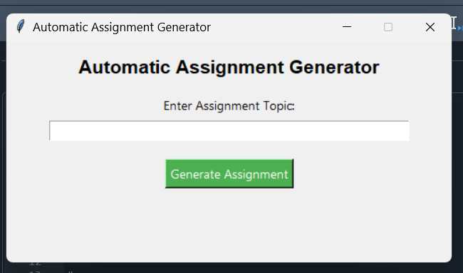
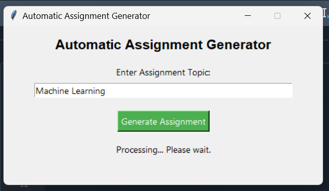

# AI-Based Automated Assignment Generator

## Project Description
This project is an AI-based automated assignment generator that:
- Takes a topic as input
- Collects 10–20 URLs from Google
- Scrapes content from websites
- Summarizes using NLP techniques
- Generates English and Urdu Word documents

## Technologies Used
- Python
- Web Scraping (BeautifulSoup)
- NLP (Sumy / Transformers)
- Machine Translation (GoogleTrans)
- Anaconda Environment

## How to Run
1. Install requirements:
   pip install -r requirements.txt

2. Run:
   python main_project.py

## AI Concepts Used
- Prompt-based automation
- NLP summarization
- Machine translation
- Web scraping
- Human-in-the-loop AI workflow

   ## Application Preview

### GUI Interface

### Processing

